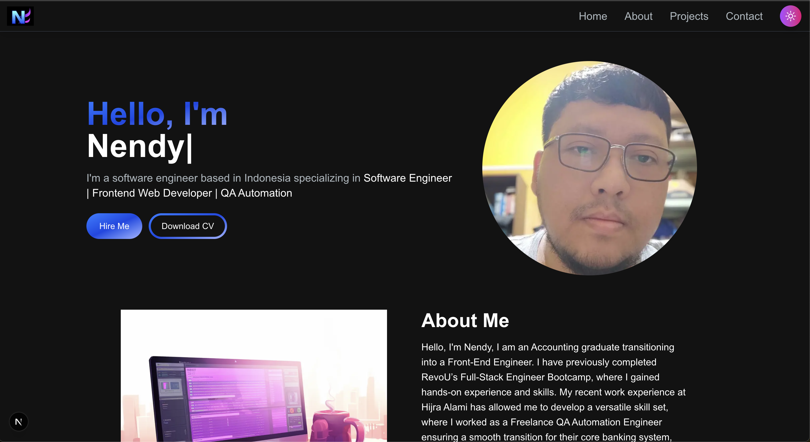

# IsnendyanKP Portfolio Website

A modern, responsive portfolio website built with Next.js and Tailwind CSS. This portfolio showcases my projects, skills, and professional experience with a clean, interactive design and smooth animations.

🚀 **[Live Demo](https://isnendyankpwebcode.vercel.app/)**



## Features

- **Modern Design**: Clean and professional UI with gradient backgrounds and smooth animations
- **Responsive**: Fully responsive design that works perfectly on all devices
- **Interactive Hero Section**: Dynamic typing animation showcasing different roles
- **Projects Showcase**: Filterable project gallery with detailed descriptions and live demos
- **About Section**: Tabbed interface displaying skills, experience, and education
- **Contact Form**: Professional contact section for inquiries
- **Smooth Navigation**: Responsive navbar with mobile hamburger menu
- **Performance Optimized**: Fast loading with Next.js optimization features

## Tech Stack

- **[Next.js 15.2.3](https://nextjs.org)** - React framework with App Router
- **[React 19.0.0](https://reactjs.org)** - JavaScript library for building user interfaces
- **[Tailwind CSS 4](https://tailwindcss.com)** - Utility-first CSS framework
- **[React Type Animation](https://react-type-animation.netlify.app)** - Typing animation component
- **[Heroicons](https://heroicons.com)** - Beautiful hand-crafted SVG icons
- **[ESLint](https://eslint.org)** - Code linting and quality assurance

## Getting Started

1. Clone the repository:

```bash
git clone https://github.com/isnendyankp/isnendyankpwebcode.git
cd isnendyankpwebcode
```

2. Install dependencies:

```bash
npm install
```

3. Run the development server:

```bash
npm run dev
# or
yarn dev
# or
pnpm dev
```

4. Open [http://localhost:3000](http://localhost:3000) with your browser to see the portfolio.

## Project Structure

```
src/
├── app/
│   ├── components/
│   │   ├── HeroSection.jsx      # Hero section with typing animation
│   │   ├── AboutSection.jsx     # About section with tabs
│   │   ├── ProjectsSection.jsx  # Projects showcase with filtering
│   │   ├── EmailSection.jsx     # Contact form section
│   │   ├── Navbar.jsx          # Navigation component
│   │   ├── ProjectCard.jsx     # Individual project card
│   │   ├── Pagination.jsx      # Project pagination
│   │   └── ...                 # Other components
│   ├── layout.js               # Root layout
│   ├── page.js                 # Main page
│   └── globals.css             # Global styles
├── public/
│   └── images/                 # Static images and project screenshots
└── plans/
    └── portfolio-development.md # Development roadmap
```

## Sections

- **Hero**: Introduction with animated text showing different professional roles
- **About**: Personal information, skills, experience, and education in tabbed format
- **Projects**: Showcases various projects with filtering by categories (Web, Mobile, Bootcamp Projects)
- **Contact**: Professional contact information and inquiry form

## Key Features

### Interactive Elements
- Typing animation in hero section
- Project filtering and search functionality
- Tabbed about section
- Responsive mobile navigation
- Smooth scroll behavior
- Hover effects and transitions

### Projects Showcase
- Detailed project descriptions with features
- Live demo and GitHub repository links
- Project categorization and filtering
- Pagination for better user experience
- High-quality project screenshots

## Scripts

```bash
npm run dev      # Start development server
npm run build    # Build for production
npm run start    # Start production server
npm run lint     # Run ESLint
```

## Customization

The portfolio is highly customizable. Key areas to modify:

- **Personal Information**: Update hero section, about section, and contact details
- **Projects**: Add your projects in `ProjectsSection.jsx`
- **Styling**: Modify colors and themes in Tailwind classes
- **Content**: Update skills, experience, and education data

## Learn More

To learn more about the technologies used:

- [Next.js Documentation](https://nextjs.org/docs) - Learn about Next.js features and API
- [Tailwind CSS](https://tailwindcss.com/docs) - Utility-first CSS framework
- [React Type Animation](https://react-type-animation.netlify.app) - Typing animation library

## Deployment

The easiest way to deploy your Next.js portfolio is to use the [Vercel Platform](https://vercel.com/new?utm_medium=default-template&filter=next.js&utm_source=create-next-app&utm_campaign=create-next-app-readme) from the creators of Next.js.

Check out the [Next.js deployment documentation](https://nextjs.org/docs/app/building-your-application/deploying) for more details.

## Contact

Feel free to reach out if you have any questions or would like to collaborate!

- **Portfolio**: [Your Portfolio URL]
- **Email**: [Your Email]
- **LinkedIn**: [https://www.linkedin.com/in/isnendyan/](https://www.linkedin.com/in/isnendyan/)
- **GitHub**: [Your GitHub]
